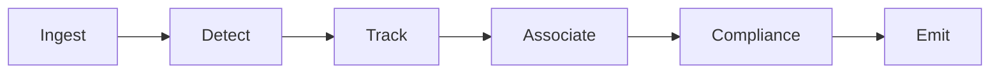
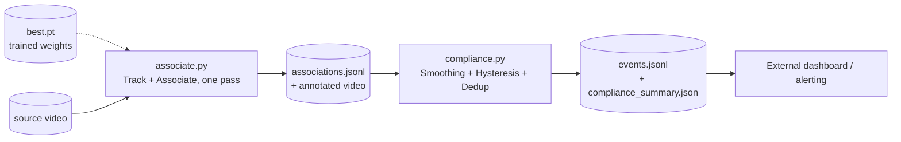
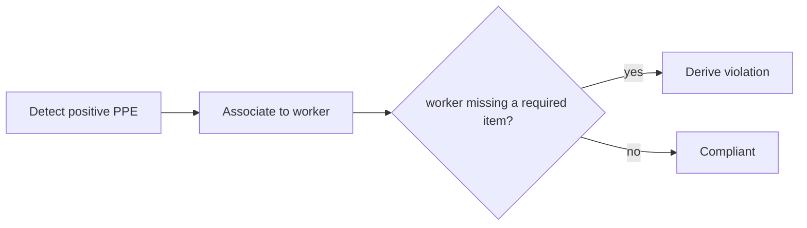

# Architecture

!!! abstract "Orientation"
    The system end to end: a linear pipeline that turns a video frame into a deduplicated ==violation event==. Six stages, each a real script with a real file handoff to the next. This page is the map; each stage has its own page under [Pipeline](pipeline/stages.md) with the full detail.

## The Pipeline

| Stage | What it does | Where |
|---|---|---|
| Ingest | Read frames from a video file, folder, or webcam | [`pipeline/detect.py`](pipeline/detector.md) |
| Detect | YOLO finds every person and PPE item in the frame | [`pipeline/detect.py`](pipeline/detector.md) |
| Track | ByteTrack gives each worker a stable id across frames | [`pipeline/track.py`](pipeline/tracking.md) |
| Associate | Bind each PPE box to the one worker it belongs to | [`pipeline/associate.py`](pipeline/tracking.md) |
| Compliance | Smooth over time and decide whether a violation is real, not a flicker | [`pipeline/compliance.py`](pipeline/compliance.md) |
| Emit | Write one deduplicated record per violation | [`events.jsonl`](pipeline/schemas.md) |

!!! info "Baseline"
    `pipeline/detect.py` is also runnable standalone, Ingest and Detect with nothing after them: every violation box counts in every frame, with no identity and no dedup. Turning many detections into ==one event== is the entire value of Track, Associate, and Compliance. None of those three stages can fix a wrong detection, only a wrong count of a correct one; raising raw accuracy is done by fine-tuning the detector.

## How the Stages Actually Run

The table above lists six conceptual stages, but they run as two scripts, not six, because Track and Associate share one video decode and one model pass, running them as separate CLI steps would decode and infer over the same footage twice for no benefit. `associate.py` imports `track.py`'s per-frame tracking function directly and calls it inside its own loop.

`make run NAME=<weights> SOURCE=<video>` runs both passes in order and prints where each output landed. `pipeline/train.py`, `pipeline/evaluate.py`, and `pipeline/download_dataset.py` produce the `best.pt` that feeds the first pass; that offline half is covered in full on [Stages](pipeline/stages.md).

## Two Organising Ideas

These principles shape every stage downstream of Detect.

1. **Track persons, not PPE.** PPE detections flicker frame to frame; a worker persists. Identity lives on the worker, tracked once; each PPE item is a per-frame observation associated onto that worker, never tracked itself. See [tracking](pipeline/tracking.md).
2. **One definition file for the vocabulary.** The set of PPE classes and the violation each absence implies lives in one place that every layer conforms to, training labels, association zone geometry, compliance state keys, and the event enum. That file is `data/vocabulary.yaml`. See [the vocabulary page](pipeline/vocabulary.md) and [ADR 0001](decisions/0001-positive-only-detection.md).

## Detection and Compliance, Separated

Positive PPE is detected (hardhat, vest); a violation is derived downstream in logic when a worker's association lacks a required item, rather than trusting the dataset's own `NO-*` classes directly. The model learns well-defined visual objects, and compliance policy becomes a tunable threshold rather than a retrain.

`NO-*` boxes are still detected and associated to a worker, `associate.py` records them, but they do not currently drive this decision either way; that remains a deliberately open question, not an oversight. The full reasoning, and what stays open, is in [ADR 0001](decisions/0001-positive-only-detection.md).

## What's Still Open

- **Emit's transport.** Today Emit is a file drop, `compliance.py` writes `events.jsonl` and one evidence JPEG per event directly to disk. Delivery beyond that, a queue, an HTTP callback, retention/privacy policy, is undecided. See [schema](pipeline/schemas.md).
- **Live/real-time mode.** The pipeline runs offline today: a finished video in, a finished `events.jsonl` out, timestamps relative to that video file. A live camera feed needs wall-clock timestamps and `compliance.py` restructured to emit incrementally rather than after a full pass. See [schema](pipeline/schemas.md#offline-upload-workflow).
- **The detector's training data.** `data/vocabulary.yaml` already matches the team's own PPE classes; the currently trained weights do not yet, they're from an earlier, broader class set. See [detector](pipeline/detector.md).
- **Every tuning threshold.** Association's zone geometry and minimum containment score, and every compliance timing threshold, are reasoned starting values, not measured against labelled ground truth yet. See [tracking](pipeline/tracking.md) and [compliance](pipeline/compliance.md).

ByteTrack vs. BoT-SORT + ReID under heavy occlusion is not on this list, it's a decided default (ByteTrack) with a documented, already-implemented upgrade path if a measured id-switch rate demands it; see [tracking](pipeline/tracking.md).

## Where to Go Next

- [Stages](pipeline/stages.md) - the offline/runtime split, and each stage in full
- [Tracking & association](pipeline/tracking.md) - the project's core work
- [Compliance state](pipeline/compliance.md) - smoothing and dedup
- [PPE vocabulary](pipeline/vocabulary.md) - the one-definition principle
- [ADR 0001](decisions/0001-positive-only-detection.md) - the decision behind detect/compliance separation
