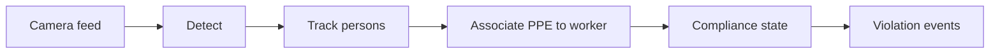

# PPE Training Pipeline

!!! abstract "Orientation"
    A vision system for construction site safety. It watches a camera feed, works out which workers are missing required protective equipment, and raises a violation event so an external monitoring system can act on it, without a person watching every camera.

## Repository Layout

| Path | Holds | Documented in |
|---|---|---|
| `pipeline/` | The runnable scripts: download, train, evaluate, detect | [Pipeline stages](pipeline/stages.md) |
| `data/` | Dataset config for the Roboflow [Construction Site Safety](https://universe.roboflow.com/roboflow-universe-projects/construction-site-safety) set, and the PPE vocabulary definition | [PPE vocabulary](pipeline/vocabulary.md) |
| `runs/`, `weights/` | Training and evaluation output, model checkpoints | [Detector](pipeline/detector.md) |
| `docs/` | This documentation site | - |

## System Overview

Each stage is one page under [Pipeline](pipeline/stages.md): what it reads and what it writes.

## Navigation

-   :material-book-open-variant:{ .lg .middle } __Knowledge__

    ---

    How the underlying methods work: detection, YOLO, Ultralytics, tracking. Start here if a term elsewhere is unfamiliar.

    [:octicons-arrow-right-24: Knowledge](knowledge/index.md)

-   :material-sitemap:{ .lg .middle } __Architecture__

    ---

    The shape of the system, end to end, and the reasoning behind it.

    [:octicons-arrow-right-24: Architecture](architecture.md)

-   :material-cogs:{ .lg .middle } __Pipeline__

    ---

    Stage by stage: detector, tracking & association, compliance, configuration, vocabulary, event schema.

    [:octicons-arrow-right-24: Pipeline](pipeline/stages.md)

-   :material-scale-balance:{ .lg .middle } __Decisions__

    ---

    The significant, hard-to-reverse choices, recorded as ADRs, with the reasoning kept alongside them.

    [:octicons-arrow-right-24: ADR log](decisions/README.md)

## Tooling

Environment setup and the GPU check live in the repo `README.md`, not here. Docs are served with `make serve` (<http://localhost:8000>).
