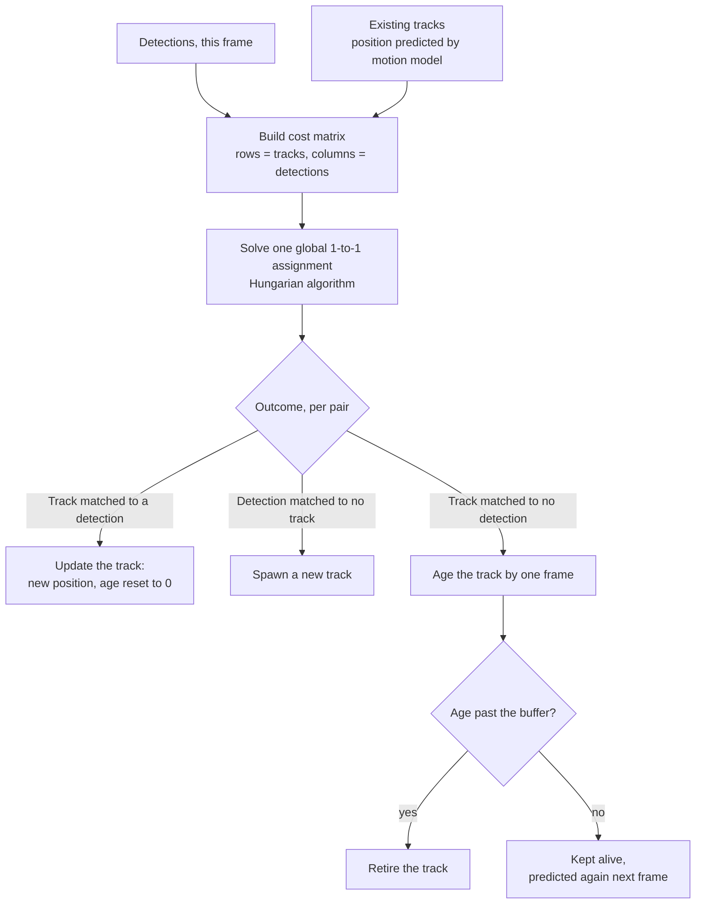
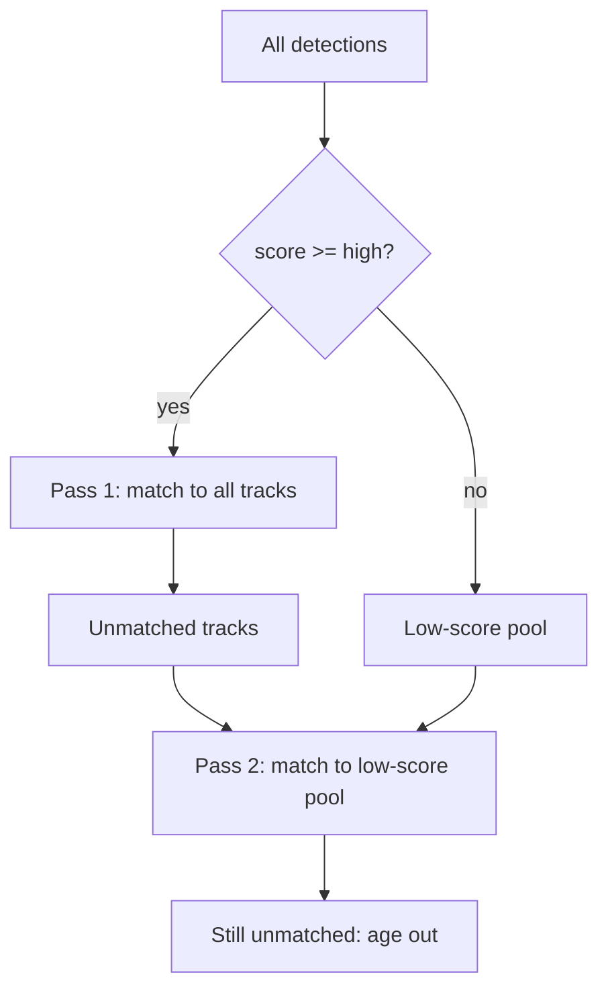

# Multi-object tracking

!!! abstract "Orientation"
    What tracking actually is, the tracking-by-detection loop that is the hard part, Kalman motion prediction, Hungarian assignment and what family of algorithm that makes this, what ByteTrack specifically adds on top, and how to measure whether any of it worked.

!!! info "Theory, Not Our Design"
    This page explains the algorithms. What we decided to feed them, and why persons only, is [tracking & association](../pipeline/tracking.md).

## What Tracking Is

A detector has no memory: frame $t$ and frame $t+1$ are independent, nothing connects a box in one to a box in the other. Tracking is the layer built on top to fix that. Reduced to one sentence: tracking is ==maintaining state for one object==, an identity, an estimated position, an age, across many frames, updating that state from new evidence each frame, and deciding when the object is gone and the state should be dropped.

## The Tracking-by-Detection Loop

Nearly every modern tracker follows the same loop to do this. Detection is treated as solved; the tracker only decides ==which detection is which object==. This decision, matching this frame's detections against last frame's tracks, is the hard part, everything else on this page exists in service of it.

In words: predict where every existing track should be this frame, score every prediction against every new detection in one cost matrix, solve that matrix as a single global assignment, then act on the three possible outcomes. A track matched to a detection updates and its age resets to zero. A detection matched to no track is new, and spawns a fresh identity. A track matched to no detection ages by one frame; if its age passes a buffer it is retired, otherwise it survives to be predicted again next frame, carrying no evidence but its own momentum until either a detection claims it or the buffer runs out.

## Why Identity Is the Hard Part

The two failure modes coming out of that loop have very different costs downstream:

| Failure | What happens | Cost to this project |
|---|---|---|
| **ID switch** | Two workers swap ids mid-clip | Violation state follows the wrong person; both events wrong |
| **Fragmentation** | One worker's track breaks into two ids | Duplicate events, and accumulated state is lost |

Both corrupt [compliance](../pipeline/compliance.md), which keys all of its state on a track's identity. This is why the tracking page insists on fixing id switches before tuning anything downstream.

## The Motion Model

Between frames an object moves a little, so a track's previous position predicts its next one. The standard choice is a ==Kalman filter==[^kalman] with a constant-velocity model.

State, position and its rate of change:

$$\mathbf{x} = [\,x,\ y,\ a,\ h,\ \dot{x},\ \dot{y},\ \dot{a},\ \dot{h}\,]^\top$$

with $(x, y)$ the box centre, $a$ the aspect ratio, and $h$ the height. The predict step advances the state and grows the uncertainty:

$$\hat{\mathbf{x}}_{t|t-1} = F\,\mathbf{x}_{t-1}, \qquad P_{t|t-1} = F P_{t-1} F^\top + Q$$

The update step folds in the matched detection $\mathbf{z}$, weighting prediction against measurement by the Kalman gain $K$:

$$K = P H^\top (H P H^\top + R)^{-1}$$

$$\mathbf{x}_t = \hat{\mathbf{x}}_{t|t-1} + K(\mathbf{z} - H\hat{\mathbf{x}}_{t|t-1})$$

$Q$ says how much you trust the motion model, $R$ how much you trust the detector. The useful intuition: $P$ ==grows while a track is unmatched==, so a briefly occluded worker has a wide, forgiving search region when they reappear, and a confidently-tracked one has a tight one.

!!! warning "Constant Velocity Is a Lie That Usually Works"
    It assumes no acceleration and, critically, that the ==camera does not move==. It handles a worker walking across frame. It handles a PTZ camera pan badly, because every track appears to accelerate at once. Worth knowing before deploying on anything but a fixed mount.

## The Assignment Problem

Given $n$ tracks and $m$ detections, build a cost matrix $C \in \mathbb{R}^{n \times m}$ where $C_{ij}$ is the cost of declaring detection $j$ to be track $i$. For motion-only trackers that cost is the IoU distance:

$$C_{ij} = 1 - \text{IoU}(\hat{B}_i, \hat{B}_j)$$

The goal is a one-to-one matching minimising total cost:

$$\min_{X} \sum_{i}\sum_{j} C_{ij} X_{ij} \quad \text{s.t.} \quad \sum_j X_{ij} \le 1,\ \ \sum_i X_{ij} \le 1,\ \ X_{ij} \in \{0, 1\}$$

The constraints are the whole point: they enforce that one track claims at most one detection and vice versa. Greedy nearest-neighbour matching violates this and produces exactly the contested-claim bug that global assignment prevents.

The ==Hungarian algorithm==[^hungarian] solves it exactly in $O(n^3)$. With frame-scale $n$ that is trivially fast. `scipy.optimize.linear_sum_assignment` is the standard implementation.

!!! info "Known in Defence Radar Tracking as GNN"
    Solving one global optimal assignment per frame, exactly what is described above, is the classical data-association technique known as ==Global Nearest Neighbor (GNN)==[^gnn]. It is the simplest member of a family that also includes Joint Probabilistic Data Association and Multiple Hypothesis Tracking, both of which keep several candidate assignments alive at once instead of committing to a single one every frame, at real computational cost. Every tracking-by-detection algorithm on this page, SORT[^sort] through ByteTrack[^bytetrack], is a GNN tracker in this sense: a Kalman filter for motion, one committed global assignment per frame, no alternative hypotheses carried forward. Nothing about that combination is specific to ByteTrack, it is the shared, decades-old baseline every one of these methods starts from.

!!! tip "The Same Structure Reappears in Association"
    Binding PPE to workers is this identical problem with a different cost, containment instead of IoU, and a different pairing, hardhats to persons instead of detections to tracks. One hardhat must not be claimed by two workers, which is precisely the $\sum_i X_{ij} \le 1$ constraint. See [association](../pipeline/tracking.md).

## ByteTrack

Given the box above, what does ByteTrack actually add? Not the motion model, and not the assignment algorithm, both are the plain GNN-plus-Kalman baseline just described, inherited from SORT[^sort], the tracking-by-detection method this whole family descends from. What ByteTrack changes is a single, earlier decision: which detections are allowed to compete for a match in the first place.

The insight is small and effective. Conventional trackers threshold detections once, keep the confident ones, and discard the rest. But a ==low-confidence detection is often a real object that is occluded==, exactly the case where the track is most at risk of being lost.

ByteTrack[^bytetrack] keeps them, and associates in ==two passes==:

1. **First pass.** High-score detections against all tracks, Hungarian on IoU distance
2. **Second pass.** Tracks left unmatched against the ==low-score== pool. A track recovered here would have been lost by a single-threshold tracker
3. Detections still unmatched and above `new_track_thresh` spawn new tracks; tracks unmatched for longer than `track_buffer` frames are retired

The asymmetry is deliberate. A low-score box is trusted enough to ==continue an existing track==, which is a weak claim backed by motion evidence, but not enough to ==start a new one==, which would create a false identity.

### Default Tracker Settings

From `ultralytics/cfg/trackers/bytetrack.yaml` as installed:

| Parameter | Default | Meaning |
|---|---|---|
| `track_high_thresh` | 0.25 | First-pass threshold |
| `track_low_thresh` | 0.1 | Floor for the second-pass pool |
| `new_track_thresh` | 0.25 | Minimum score to spawn an identity |
| `track_buffer` | 30 | Frames a lost track survives |
| `match_thresh` | 0.8 | Maximum cost accepted as a match |
| `fuse_score` | `True` | Blend detection score into the IoU cost |

`track_buffer` is measured in ==frames, not seconds==, so its meaning changes with frame rate. At 30 fps the default tolerates a one-second occlusion; at 10 fps the same number tolerates three. Any site running a different frame rate needs this rescaled, and it is the first thing to check when tracks die through occlusions.

### What ByteTrack Cannot Do

There is ==no appearance model==. Matching is motion and overlap only, so two workers who cross while overlapping are separated by nothing but predicted position. Similar clothing does not help or hurt, because the tracker never looks at pixels.

That is the upgrade path: BoT-SORT[^botsort] and DeepOCSORT[^deepocsort] add a ReID embedding on top of the same GNN-plus-Kalman skeleton, matching on visual similarity as well as motion, at real inference cost, the same idea DeepSORT[^deepsort] added to the original SORT baseline before ByteTrack went back to motion-only. The installed version ships `botsort`, `deepocsort`, `ocsort`, `fasttrack`, and `tracktrack` alongside `bytetrack`, so switching is a config change rather than a rewrite.

The project's position is to start with ByteTrack and upgrade ==on measured evidence==, not on principle. See [tracking](../pipeline/tracking.md).

## Measuring a Tracker

mAP says nothing here, it never asks whether an identity persisted. [Precision and recall](precision-recall.md)'s idea, correct calls over claimed calls, reappears below at the identity level; [mAP](object-detection.md#average-precision)'s idea, sweep a threshold and integrate, reappears in HOTA.

### MOTA

$$\text{MOTA} = 1 - \frac{\sum_t \left(FN_t + FP_t + IDSW_t\right)}{\sum_t GT_t}$$

Every frame $t$ contributes its missed detections ($FN_t$), false detections ($FP_t$), and identity switches ($IDSW_t$) to one running error total, divided by the total number of ground-truth objects across the sequence[^mota]. A perfect tracker scores $1$; a tracker that makes more mistakes than there are objects to find can score negative. The problem, for this project, is in that sum: an identity switch is one term among three, so a tracker can post a good MOTA while switching identities constantly, as long as its detection is strong enough to bury the switches in the average.

### IDF1

$$\text{IDF1} = \frac{2 \cdot IDTP}{2 \cdot IDTP + IDFP + IDFN}$$

The same harmonic-mean shape as [F1](precision-recall.md#f1-score), but computed only after first solving one matching between predicted and ground-truth *identities* over the whole sequence, not per frame[^idf1]. $IDTP$ is then the number of frames that matched identity pair agree on; $IDFP$ and $IDFN$ are the frames where they disagree. A tracker that finds every box correctly but assigns three different ids to one object over a clip scores well on frame-level precision and recall and poorly on IDF1, precisely the failure mode this project cares about: a violation event is only correct if the identity holding it was correct for the whole interval.

### HOTA

$$\text{HOTA} = \sqrt{\text{DetA} \times \text{AssA}}$$

Two scores multiplied under a square root, a geometric mean[^hota]. $\text{DetA}$ measures whether the boxes are right, a Jaccard-style score built from TP/FP/FN, the same shape as IoU. $\text{AssA}$ measures whether, given a correctly matched box, its identity stayed consistent across that object's whole lifetime. Like [mAP](object-detection.md#average-precision), HOTA is computed at several IoU thresholds and averaged rather than fixed at one. The geometric mean matters for the same reason F1's harmonic mean does: a tracker cannot buy a good HOTA by being excellent at detection and careless with identity, or the reverse, a weak score in either factor drags the product down.

### ID Switches

Simplest of the four: how many times, across the whole sequence, a track's assigned identity does not match the identity it was matched to the previous frame. No formula beyond the count itself, everything above exists to put that count in context against how much the tracker actually got right.

| Metric | Captures | Blind to |
|---|---|---|
| **MOTA** | Detection and identity errors, combined into one rate | An identity switch is a small fraction of the sum, easily buried by good detection |
| **IDF1** | Whether one identity holds one object for its whole lifetime | Detection quality on its own; two trackers can tie on IDF1 with very different box accuracy |
| **HOTA** | Detection and association quality, kept as two separate factors | Nothing deliberately, that separation is the entire point of the metric |
| **ID switches** | Raw count of identity changes | Severity or duration, one switch on a two-second clip counts the same as one on a two-hour clip |

MOTA is dominated by detection errors and can look healthy while identities churn. IDF1 and HOTA are the ones that reflect what this project needs, since a violation event is only correct if the identity holding it was correct for the whole interval.

## Related

- [Object detection](object-detection.md) - IoU, reused here as an assignment cost, and mAP's threshold-sweep idea, reused in HOTA
- [Precision, recall, and F1](precision-recall.md) - the harmonic-mean idea IDF1 reuses at the identity level
- [Tracking & association](../pipeline/tracking.md) - our design built on this
- [Compliance state](../pipeline/compliance.md) - what consumes a track's identity

## References

[^kalman]: Kalman, R. E. (1960). A New Approach to Linear Filtering and Prediction Problems. *Journal of Basic Engineering*, 82(1), 35-45.
[^hungarian]: Kuhn, H. W. (1955). The Hungarian Method for the Assignment Problem. *Naval Research Logistics Quarterly*, 2(1-2), 83-97.
[^gnn]: Bar-Shalom, Y., Willett, P. K., & Tian, X. (2011). *Tracking and Data Fusion: A Handbook of Algorithms*. YBS Publishing. Covers Global Nearest Neighbor alongside JPDA and Multiple Hypothesis Tracking as the classical data-association family.
[^sort]: Bewley, A., Ge, Z., Ott, L., Ramos, F., & Upcroft, B. (2016). Simple Online and Realtime Tracking. <https://arxiv.org/abs/1602.00763>
[^deepsort]: Wojke, N., Bewley, A., & Paulus, D. (2017). Simple Online and Realtime Tracking with a Deep Association Metric. <https://arxiv.org/abs/1703.07402>
[^bytetrack]: Zhang, Y., Sun, P., Jiang, Y., Yu, D., Weng, F., Yuan, Z., Luo, P., Liu, W., & Wang, X. (2022). ByteTrack: Multi-Object Tracking by Associating Every Detection Box. <https://arxiv.org/abs/2110.06864>
[^botsort]: Aharon, N., Orfaig, R., & Bobrovsky, B.-Z. (2022). BoT-SORT: Robust Associations Multi-Pedestrian Tracking. <https://arxiv.org/abs/2206.14651>
[^deepocsort]: Maggiolino, G., Ahmad, A., Cao, J., & Kitani, K. (2023). Deep OC-SORT: Multi-Pedestrian Tracking by Adaptive Re-Identification. <https://arxiv.org/abs/2302.11813>
[^mota]: Bernardin, K., & Stiefelhagen, R. (2008). Evaluating Multiple Object Tracking Performance: The CLEAR MOT Metrics. *EURASIP Journal on Image and Video Processing*.
[^idf1]: Ristani, E., Solera, F., Zou, R., Cucchiara, R., & Tomasi, C. (2016). Performance Measures and a Data Set for Multi-Target, Multi-Camera Tracking. <https://arxiv.org/abs/1609.01775>
[^hota]: Luiten, J., Osep, A., Dendorfer, P., Torr, P., Geiger, A., Leal-Taixé, L., & Leibe, B. (2020). HOTA: A Higher Order Metric for Evaluating Multi-Object Tracking. <https://arxiv.org/abs/2009.07736>
