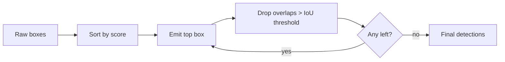

# Object detection

!!! abstract "Orientation"
    What object detection is as a task, the families of models built to solve it, and the vocabulary every later page assumes: how two boxes are compared, how duplicates are suppressed, and how a single mAP number is built out of raw predictions.

## Definition

Object detection asks a stricter question than image classification. Classification assigns one label to a whole image. Detection must additionally say *where*: for every object instance present, a location and a class[^voc].

| Task | Output | Answers |
|---|---|---|
| Classification | One label | What is in the image |
| Object detection | Boxes + labels | What, and roughly where, per instance |
| Semantic segmentation | One label per pixel | What, at every pixel, with no separation between two instances of the same class |
| Instance segmentation | One label + mask per instance | What, exactly where, and which instance |

The box-and-class output shape used throughout this page was formalised by the PASCAL VOC challenge[^voc] and later scaled up, in image count and class count, by COCO[^coco]. Both remain the benchmarks the field reports results against.

## Model Families

Three broad approaches have been used to produce that box-and-class output. This project uses the second.

| Family | Idea | Founding work | NMS at inference |
|---|---|---|---|
| Two-stage | Propose candidate regions, then classify each one | R-CNN[^rcnn] → Fast R-CNN[^fast-rcnn] → Faster R-CNN[^faster-rcnn] | Yes |
| One-stage / single-shot | Predict boxes and classes directly in one pass over a grid | YOLO[^yolo], SSD[^ssd] | Yes, until end-to-end variants |
| Transformer / set-prediction | Predict a fixed-size set of objects directly, no proposals, no grid | DETR[^detr] | No |

**Two-stage detectors** separate "where might something be" from "what is it". R-CNN[^rcnn] generated region proposals externally and ran a CNN classifier over each one. Fast R-CNN[^fast-rcnn] shared the convolutional computation across all proposals in one image instead of recomputing it per region. Faster R-CNN[^faster-rcnn] replaced the external, non-learned proposal step with a trainable Region Proposal Network, making the whole detector one network. Accurate, and historically the slower family, because the network effectively runs once to propose and again to classify.

**One-stage detectors** predict boxes and classes in a single forward pass, no proposal step. YOLO[^yolo] and SSD[^ssd] introduced this within a year of each other, trading some accuracy for a large speed gain aimed at real-time use, the property a camera-feed application needs from any detector it picks. See [YOLO](yolo.md) for how the architecture works, and [detector](../pipeline/detector.md) for which model and scale this project currently trains, that is a tracked decision, not theory, and it changes.

**Transformer / set-prediction detectors** drop the grid and the proposals entirely and predict a fixed-size set of objects directly, trained with a matching loss against ground truth. DETR[^detr] was the first to do this end-to-end, with no NMS step at all, anywhere in the pipeline. The same idea, folded into a single-stage architecture instead of a transformer, is where YOLO26 gets its own end-to-end, NMS-free design; see [YOLO: end-to-end, NMS-free detection](yolo.md#end-to-end-nms-free-detection).

## What a Detector Returns

For one image a detector emits a set of predictions

$$\hat{\mathcal{D}} = \{(\hat{B}_i, \hat{c}_i, \hat{s}_i)\}_{i=1}^{N}$$

where $\hat{B}_i$ is a box, $\hat{c}_i$ a class label, and $\hat{s}_i \in [0,1]$ a confidence score. Boxes are usually stored corner-form $(x_1, y_1, x_2, y_2)$ for geometry and centre-form $(x, y, w, h)$ for regression. Ultralytics exposes both on a result: `box.xyxy` and `box.xywh`[^ultralytics].

!!! warning "Confidence Is Not Probability"
    $\hat{s}$ is a calibrated-ish ranking score, not $P(\text{correct})$. A confidence threshold is normally set by looking at outputs on real examples, not by picking a probability that merely sounds acceptable. What this project currently sets it to is a tracked decision on [detector](../pipeline/detector.md).

## Intersection over Union

The overlap measure underneath thresholds, NMS, and matching alike, standardised for detection evaluation by PASCAL VOC[^voc]:

$$\text{IoU}(A, B) = \frac{|A \cap B|}{|A \cup B|} = \frac{|A \cap B|}{|A| + |B| - |A \cap B|}$$

It is $0$ for disjoint boxes and $1$ for identical ones, and it is scale-invariant, which is exactly why it is the default comparison.

### Where IoU Is the Wrong Tool

Scale invariance cuts both ways. Take a hardhat of area $a$ fully inside a person box of area $A$:

$$\text{IoU} = \frac{a}{A} \quad \text{which} \to 0 \ \text{ as } \ A \gg a$$

A perfectly-worn hardhat scores near zero against its wearer. That is not a detector failure, it is IoU answering a different question than the one being asked. For "is this small thing inside that big thing", use ==containment==:

$$\text{containment}(a, A) = \frac{|a \cap A|}{|a|}$$

which is $1$ whenever the hardhat lies entirely within the region, regardless of how large the person is. This is the reason [association](../pipeline/tracking.md) scores by containment rather than IoU.

## Non-Maximum Suppression

A detector fires many times around one object, so duplicates are pruned. Classic greedy NMS[^nms], per class:

1. Sort predictions by score descending
2. Take the top-scoring box $\hat{B}$, emit it, remove it from the pool
3. Discard every remaining $\hat{B}'$ with $\text{IoU}(\hat{B}, \hat{B}') > \tau$
4. Repeat until the pool is empty

$\tau$ is the `iou` argument in Ultralytics[^ultralytics]. Its failure mode matters on a construction site: NMS cannot tell two genuinely overlapping workers from one worker detected twice, so a **crowded scene loses real people** at low $\tau$. Raising $\tau$ keeps crowds but readmits duplicates.

!!! info "YOLO26's Architecture Removes This Step"
    YOLO26 is end-to-end: it predicts a duplicate-free set directly, so a model built this way needs no NMS at inference. See [YOLO](yolo.md#end-to-end-nms-free-detection). The trade-off does not vanish, it moves into training, and its architectural root is the DETR-style set prediction described above. Whether YOLO26 is what this project currently trains is tracked on [detector](../pipeline/detector.md), not here.

## True Positive Criteria

A prediction is a true positive if it has the right class and clears an IoU threshold against a ground-truth box not already claimed, the matching rule defined by the PASCAL VOC protocol[^voc]:

$$\hat{B}_i \ \text{is TP} \iff \hat{c}_i = c_j \ \wedge \ \text{IoU}(\hat{B}_i, B_j) \geq \tau \ \wedge \ B_j \ \text{unmatched}$$

The "unmatched" clause is what makes a second detection of the same object a false positive rather than a second success. Greedy matching in score order fixes which prediction gets the credit.

## Precision, Recall, F1

Covered on its own page: [Precision, recall, and F1](precision-recall.md), the intuition, the formulas, and why F1 uses a harmonic mean rather than an average.

All three move when the confidence threshold moves; [mAP](#average-precision), below, exists to remove that dependence by sweeping the threshold instead of fixing it.

## Average Precision

Sweep the confidence threshold from high to low. Each step adds predictions, which can only raise recall and usually lowers precision, tracing a precision-recall curve $p(r)$. AP is the area under it:

$$\text{AP} = \int_0^1 p(r)\, dr$$

Computed on a finite set, the curve is first made monotonically non-increasing, the interpolation method fixed by PASCAL VOC[^voc], so that a bump at high recall cannot inflate the score:

$$p_{\text{interp}}(r) = \max_{r' \geq r} p(r')$$

then integrated as a finite sum over the recall points where it changes. Averaging AP over classes gives ==mAP==.

### mAP50 vs. mAP50-95

The IoU threshold $\tau$ that defines a TP is itself a choice, so results are reported at more than one:

| Metric | Definition | Sensitive to |
|---|---|---|
| mAP50 | AP at $\tau = 0.5$, averaged over classes | Whether the object was found |
| mAP75 | AP at $\tau = 0.75$ | Noticeably stricter localisation |
| mAP50-95 | Mean of AP at $\tau = 0.50, 0.55, \dots, 0.95$ | Localisation quality overall |

$$\text{mAP}_{50\text{-}95} = \frac{1}{10}\sum_{k=0}^{9} \text{mAP}_{\,\tau = 0.50 + 0.05k}$$

mAP50 is the original PASCAL VOC[^voc] protocol, a single IoU threshold of 0.5. mAP50-95, averaging over ten thresholds, is COCO's[^coco] stricter extension, and the one this project reports; see [detector](../pipeline/detector.md).

The gap between the two diagnoses the failure. Suppose a model's mAP50 sits well above its mAP50-95, say $0.47$ against $0.34$: objects are being found, but the boxes drawn around them are loose. That is the normal signature of an undertrained model, not a labelling problem.

!!! tip "Real Numbers, Not a Hypothetical"
    This project's own baseline runs show exactly this gap; see [detector](../pipeline/detector.md).

!!! danger "A Class Average Hides the Class You Care About"
    A dataset with many classes, where only a handful are the ones that actually matter, can post a respectable mean mAP while the one class being relied on barely works. A single headline number hides exactly this. This project's own per-class breakdown, not just the mean, is on [detector](../pipeline/detector.md).

## What These Metrics Cannot Tell You

mAP scores ==frames==. This project emits ==events==. A detector that flickers on and off every other frame can post a fine mAP while producing an unusable alert stream, because mAP has no notion of time, identity, or duplicate alerts. Event-level evaluation is a separate measurement, described in [compliance](../pipeline/compliance.md).

## Related

- [Precision, recall, and F1](precision-recall.md) - the metrics this page's TP/FP/FN feed into
- [YOLO](yolo.md) - the architecture producing these predictions
- [Multi-object tracking](multi-object-tracking.md) - where IoU reappears as an assignment cost
- [Detector](../pipeline/detector.md) - our measured numbers

## References

[^voc]: Everingham, M., Van Gool, L., Williams, C. K. I., Winn, J., & Zisserman, A. (2010). The PASCAL Visual Object Classes (VOC) Challenge. *International Journal of Computer Vision*, 88(2), 303-338. <http://host.robots.ox.ac.uk/pascal/VOC/>
[^coco]: Lin, T.-Y., et al. (2014). Microsoft COCO: Common Objects in Context. <https://arxiv.org/abs/1405.0312>
[^rcnn]: Girshick, R., Donahue, J., Darrell, T., & Malik, J. (2014). Rich Feature Hierarchies for Accurate Object Detection and Semantic Segmentation. <https://arxiv.org/abs/1311.2524>
[^fast-rcnn]: Girshick, R. (2015). Fast R-CNN. <https://arxiv.org/abs/1504.08083>
[^faster-rcnn]: Ren, S., He, K., Girshick, R., & Sun, J. (2015). Faster R-CNN: Towards Real-Time Object Detection with Region Proposal Networks. <https://arxiv.org/abs/1506.01497>
[^ssd]: Liu, W., et al. (2016). SSD: Single Shot MultiBox Detector. <https://arxiv.org/abs/1512.02325>
[^yolo]: Redmon, J., Divvala, S., Girshick, R., & Farhadi, A. (2016). You Only Look Once: Unified, Real-Time Object Detection. <https://arxiv.org/abs/1506.02640>
[^detr]: Carion, N., et al. (2020). End-to-End Object Detection with Transformers. <https://arxiv.org/abs/2005.12872>
[^nms]: Neubeck, A., & Van Gool, L. (2006). Efficient Non-Maximum Suppression. *18th International Conference on Pattern Recognition (ICPR'06)*.
[^ultralytics]: Ultralytics. YOLO Predict/Track documentation, `Boxes` result object and tracker `iou`/`conf` arguments. <https://docs.ultralytics.com/>
