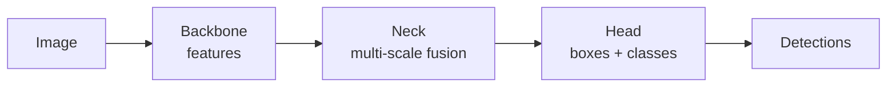
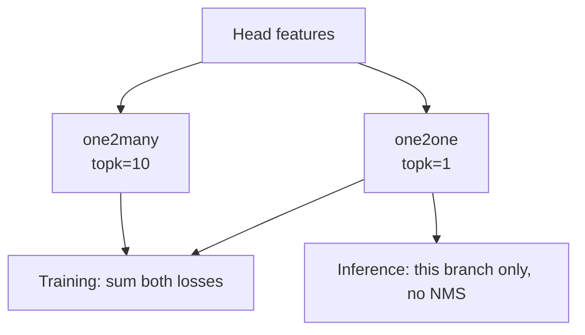

# YOLO

!!! abstract "Orientation"
    What kind of network this is and what its name means, the architecture end to end in simple terms, how a modern anchor-free head is built, what the three loss terms do, how the YOLO family evolved, what changed between YOLO11 and YOLO26 specifically, and the difference between the five model scales.

!!! info "Checked Against the Installed Version"
    Architectural claims about YOLO26 below were read from `ultralytics 8.4.133` as installed in `.venv`, specifically `cfg/models/26/yolo26.yaml`, `nn/modules/head.py`, and `utils/loss.py`. Re-check them when the pin moves. Claims about earlier generations (YOLO11 and before) are general field knowledge, footnoted to their source below rather than checked against an installed copy.

## What YOLO Is

Two facts make sense of everything else on this page.

**It is a Convolutional Neural Network (CNN).** A CNN is a neural network built almost entirely from small filters that slide across the image. Each filter looks for one simple pattern, an edge, a corner, a patch of a particular colour, checked at every position in the image at once. Stacking many such layers lets the network build up from simple patterns to complex ones: edges combine into textures, textures into shapes, shapes into recognisable parts of an object. By the time an image reaches the network's last layers it has been turned into a compact description of what is where, features, not pixels any more.

**"You Only Look Once" names what it replaced.** Detectors before YOLO worked by proposing many candidate regions of an image, boxes that might contain something, and running a classifier over each region separately, in effect looking at the image over and over, once per candidate, sometimes thousands of times for one image. YOLO instead runs the whole image through its CNN exactly once. That single pass produces every detection at once: no separate look per region, and no second network checking a first network's guesses.

## The Architecture in Simple Terms

So what does that one pass actually consist of, inside the network? Three stages, each handing its output to the next:



The **backbone** is the stack of convolutional filters described above: it compresses the image into features, coarse shapes early, fine texture later, at several resolutions at once. The **neck** mixes those resolutions together, so a location has access to both fine detail and the broader context around it. The **head** then looks at every location on that mixed feature map and asks, independently, "is an object centred here, and what is it". No stage revisits an earlier one, and nothing proposes candidate regions for a second pass to check, the whole thing runs once, which is the mechanism behind the name.

| Part | Job | In YOLO26n |
|---|---|---|
| Backbone | Turn pixels into features at several scales | `Conv` + `C3k2` blocks, `SPPF`, `C2PSA` |
| Neck | Fuse fine detail with coarse semantics | PAN-FPN, upsample and concat both directions |
| Head | Emit boxes and class scores per location | `Detect` on P3/8, P4/16, P5/32 |

### Why Three Scales

P3, P4, and P5 carry stride 8, 16, and 32, the feature-pyramid idea[^fpn] behind fusing several resolutions in the neck above. A stride-32 feature cell covers a 32x32 pixel region, which is ample for a person and hopeless for a distant small object. Small objects survive only on P3.

This is the mechanism behind the resolution question in [detector](../pipeline/detector.md): raising `imgsz` does not change the network, it changes how many pixels a small object occupies on the P3 map. A small enough item can simply fail to exist at any feature level at a given resolution, which this project has run into in practice; see [detector](../pipeline/detector.md).

## Anchor-Free Prediction

Older YOLO versions matched objects to hand-designed ==anchor boxes==[^yolov2], priors of fixed shape and size, and regressed offsets from them. Anchors need tuning per dataset and inflate the output count.

Modern YOLO is anchor-free[^fcos]: each spatial location predicts its distance to the four sides of one box,

$$\hat{B} = (l, t, r, b) \quad \text{giving} \quad x_1 = x_a - l,\ \ y_1 = y_a - t,\ \ x_2 = x_a + r,\ \ y_2 = y_a + b$$

where $(x_a, y_a)$ is the cell centre. No priors, no per-dataset anchor tuning.

### Task-Aligned Assignment

Which locations should be responsible for an object during training? Modern YOLO scores each candidate by a metric that ==couples classification and localisation==[^tal]:

$$t = s^{\alpha} \cdot \text{IoU}^{\beta}$$

with $s$ the predicted class score for the true class. The top-$k$ candidates by $t$ are assigned as positives. Coupling the two matters: a location that localises well but classifies the object as something else is not a good positive, and neither is the reverse.

The $k$ appears directly in the source as `tal_topk`, and its value is the hinge of YOLO26's end-to-end design below.

## The Loss

Detection loss is three terms over the assigned positives:

$$\mathcal{L} = \lambda_{\text{box}} \mathcal{L}_{\text{box}} + \lambda_{\text{cls}} \mathcal{L}_{\text{cls}} + \lambda_{\text{dfl}} \mathcal{L}_{\text{dfl}}$$

These are the three columns Ultralytics writes into `results.csv` each epoch as `train/box_loss`, `train/cls_loss`, and `train/l1_loss`.

### Box Regression: CIoU

Plain IoU has zero gradient for non-overlapping boxes, so the box term uses ==Complete IoU==[^ciou], which adds centre distance and aspect-ratio penalties:

$$\mathcal{L}_{\text{CIoU}} = 1 - \text{IoU} + \frac{\rho^2(\mathbf{b}, \mathbf{b}^{gt})}{c^2} + \alpha v$$

where $\rho$ is the centre-point distance, $c$ the diagonal of the smallest box enclosing both, and $v$ an aspect-ratio consistency term. The middle term keeps a usable gradient when the boxes do not yet touch.

### Classification

Binary cross-entropy per class, not a softmax, so classes are independent. This is the right shape for detection: two classes such as a person and an item of protective equipment can co-occur in one image and are not competing hypotheses.

### Distribution Focal Loss and Its Removal

Rather than regress each distance as one number, DFL[^dfl] predicts a ==discrete distribution== over `reg_max` bins and takes the expectation:

$$\hat{d} = \sum_{i=0}^{reg\_max-1} i \cdot P(i), \qquad P = \text{softmax}(\text{logits})$$

This gives the model a way to express uncertainty about an edge, which helps on ambiguous boundaries. It costs $4 \times reg\_max$ output channels per location instead of $4$.

!!! info "YOLO26 Turns DFL Off"
    `cfg/models/26/yolo26.yaml` sets `reg_max: 1`, and `head.py:137` reads

    ```python
    self.dfl = DFL(self.reg_max) if self.reg_max > 1 else nn.Identity()
    ```

    so with one bin the module is an identity and the head emits 4 channels per location, predicting distances directly. The stated motivation is a simpler head that exports and quantises more cleanly. The `l1_loss` column in `results.csv` is the term that replaces it.

## End-to-End, NMS-Free Detection

The headline change. `yolo26.yaml` declares `end2end: True`, and the model carries ==two prediction branches== trained together, visible in `E2EDetectLoss` at `utils/loss.py:1273`:

```python
self.one2many = v8DetectionLoss(model, tal_topk=10)
self.one2one  = v8DetectionLoss(model, tal_topk=1)
```

The difference is only `tal_topk`, the number of locations allowed to claim each object:

| Branch | `tal_topk` | Effect |
|---|---|---|
| one-to-many | 10 | Ten positives per object, rich gradient, fast convergence, duplicates by construction |
| one-to-one | 1 | Exactly one positive per object, so the branch learns to be duplicate-free |

Training sums both losses. Inference uses only `one2one` (`head.py:185`), which already emits at most one box per object, so ==NMS is not needed==. This dual-branch training scheme, one branch for signal and one for the duplicate-free result that ships, is the mechanism YOLOv10[^yolov10] introduced; YOLO26 carries it forward alongside removing DFL entirely, above.



The dense branch supplies the learning signal that a one-positive-per-object branch would otherwise be too sparse to get. Both are trained; only one is shipped.

!!! warning "What End-to-End Detection Changes"
    - Any leftover NMS/`iou` argument in code written for an NMS-based model has ==no effect== on an end-to-end model; harmless but misleading if left in place.
    - Crowded-scene behaviour becomes a property of the trained weights, not a runtime knob. Two overlapping objects can no longer be recovered by nudging an NMS threshold, so it needs verifying directly on real footage.
    - Exported graphs contain no NMS step, which simplifies deployment.

    Where this project's own code stands against each of these points is tracked on [detector](../pipeline/detector.md), not here.

## The YOLO Family

Every term used above, anchor-free, task-aligned assignment, end-to-end, now has a definition behind it. With that vocabulary in hand: "YOLO" names a lineage, not one fixed network. Every generation keeps the founding idea from the top of this page, one forward pass over the whole image, and changes what happens inside it. Three shifts matter:

| Shift | Before | After | Introduced by |
|---|---|---|---|
| Box prediction | Hand-designed anchor priors, tuned per dataset | Anchor-free: predict distance to each box edge directly | FCOS[^fcos], anchor priors themselves added earlier by YOLOv2[^yolov2] |
| Assignment during training | Simple IoU or centre-in-box rules | Task-aligned: score couples classification confidence with localisation quality | TOOD[^tal] |
| Duplicate removal | Greedy NMS after inference, always | End-to-end: the network is trained to emit one box per object, no NMS step at all | YOLOv10[^yolov10], building on set-prediction detection generally[^detr-note] |

Ultralytics' own YOLO releases picked these up over time: anchor-free became standard from YOLOX[^yolox] onward, and end-to-end training is the newest of the three shifts, arriving in the generation this project trains.

[^detr-note]: The general idea of a detector trained to emit a duplicate-free set directly, with no post-processing step, was first shown end-to-end by DETR; see [Object detection: model families](object-detection.md#model-families) for that lineage.

## YOLO11 vs YOLO26

YOLO11[^ultralytics] is the widely-deployed generation immediately before the one this project trains. Comparing the two names exactly what the "end-to-end, NMS-free" section above is about:

| Aspect | YOLO11 | YOLO26 |
|---|---|---|
| Box distance regression | Distribution Focal Loss, an expectation over a learned distribution per edge[^dfl] | DFL removed (`reg_max: 1`), each distance regressed directly |
| Duplicate removal | Standard greedy NMS at inference | No NMS at inference, a dedicated training branch is built to be duplicate-free |
| Training-time assignment | One task-aligned assignment branch | Two branches trained together: a many-positives branch for signal, a one-positive branch for the duplicate-free result that ships |
| Exported graph | Includes an NMS post-processing step | No NMS step in the graph |

Both mechanisms in the right-hand column, DFL's removal and the two-branch training, are the ones explained in full above, sourced from the installed YOLO26 code.

## Model Scale

A YOLO config is really one template stretched by two multipliers: **depth**, roughly how many times a block repeats, how many processing steps deep the network runs, and **width**, how many channels each layer carries, roughly how much it can represent at each step. Stretching either up gives the network more capacity at the cost of more computation per image, the cost that GFLOPs measures below.

`yolo26.yaml` defines five scales through exactly those two multipliers, with parameter counts recorded in the file:

| Scale | Parameters | GFLOPs |
|---|---|---|
| `n` | 2,572,280 | 6.1 |
| `s` | 10,009,784 | 22.8 |
| `m` | 21,896,248 | 75.4 |
| `l` | 26,299,704 | 93.8 |
| `x` | 58,993,368 | 209.5 |

Which scale to run is a project decision, not theory, it trades inference speed against accuracy for the deployment target. See [detector](../pipeline/detector.md) for what is currently trained and why.

## Related

- [Object detection](object-detection.md) - IoU, NMS, model families, and the metrics used above
- [Ultralytics](ultralytics.md) - the framework that trains and runs these models
- [Detector](../pipeline/detector.md) - our model choice and measured results
- [ADR 0001](../decisions/0001-positive-only-detection.md) - which classes we ask it to learn

## References

[^yolov2]: Redmon, J., & Farhadi, A. (2016). YOLO9000: Better, Faster, Stronger. <https://arxiv.org/abs/1612.08242>
[^fpn]: Lin, T.-Y., Dollár, P., Girshick, R., He, K., Hariharan, B., & Belongie, S. (2017). Feature Pyramid Networks for Object Detection. <https://arxiv.org/abs/1612.03144>
[^fcos]: Tian, Z., Shen, C., Chen, H., & He, T. (2019). FCOS: Fully Convolutional One-Stage Object Detection. <https://arxiv.org/abs/1904.01355>
[^yolox]: Ge, Z., Liu, S., Wang, F., Li, Z., & Sun, J. (2021). YOLOX: Exceeding YOLO Series in 2021. <https://arxiv.org/abs/2107.08430>
[^tal]: Feng, C., Zhong, Y., Gao, Y., Scott, M. R., & Huang, W. (2021). TOOD: Task-aligned One-stage Object Detection. <https://arxiv.org/abs/2108.07755>
[^ciou]: Zheng, Z., Wang, P., Liu, W., Li, J., Ye, R., & Ren, D. (2020). Distance-IoU Loss: Faster and Better Learning for Bounding Box Regression. <https://arxiv.org/abs/1911.08287>
[^dfl]: Li, X., Wang, W., Wu, L., Chen, S., Hu, X., Li, J., Tang, J., & Yang, J. (2020). Generalized Focal Loss: Learning Qualified and Distributed Bounding Boxes for Dense Object Detection. <https://arxiv.org/abs/2006.04388>
[^yolov10]: Wang, A., Chen, H., Liu, L., Chen, K., Lin, Z., Han, J., & Ding, G. (2024). YOLOv10: Real-Time End-to-End Object Detection. <https://arxiv.org/abs/2405.07813>
[^ultralytics]: Ultralytics. YOLO documentation and model release notes, YOLO11 and YOLO26. <https://docs.ultralytics.com/>
