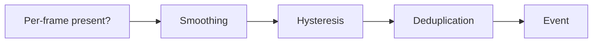
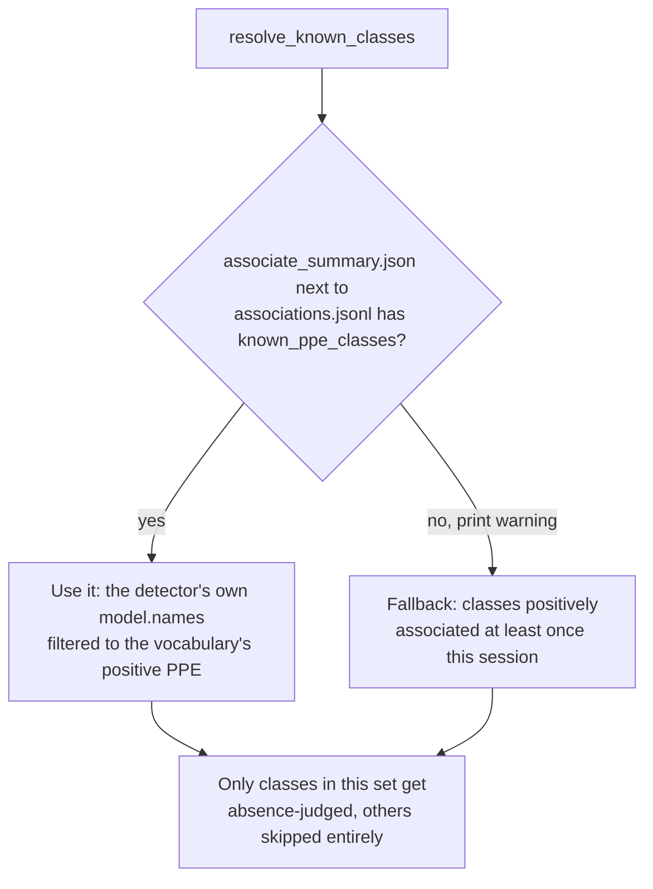
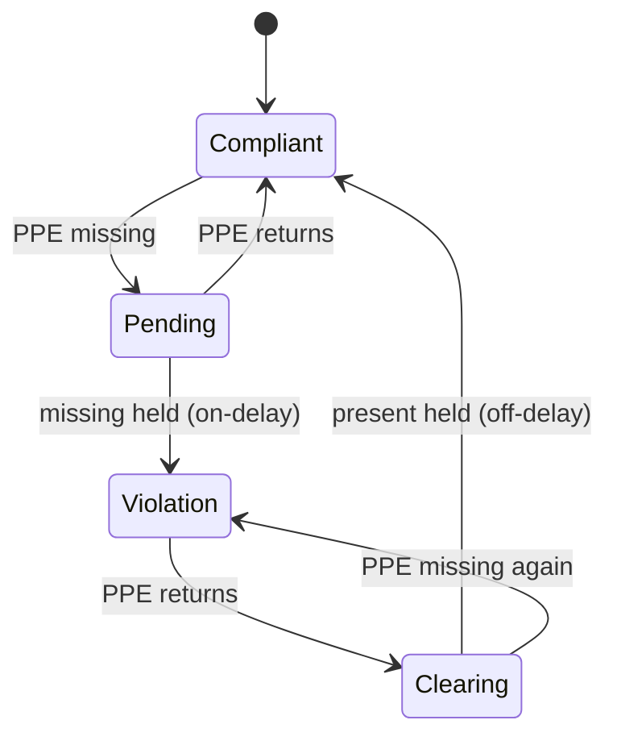
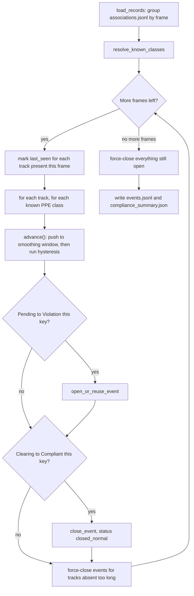

# Compliance state

!!! abstract "Orientation"
    Temporal smoothing and violation deduplication, `pipeline/compliance.py`. Turn a noisy stream of per-frame ==PPE-present booleans== into a small number of clean, deduplicated ==violation events==. Runs entirely on `associate.py`'s output, no model, no video, just `associations.jsonl` in and `events.jsonl` out.

## Three Filters in Series

Each filter removes a different kind of noise. All three run in seconds, not frames, converted from each association record's own timestamp, not a raw frame count.



| Filter | Removes | Default |
|---|---|---|
| Smoothing | Single-frame detection dropouts | 0.5s window, 50% present ratio |
| Hysteresis | Rapid flip-flop at the boundary | 3.0s on-delay, 2.0s off-delay |
| Deduplication | Repeat alerts for the same worker+type | 5.0s cooldown, 3.0s track-loss close |

Every default lives in `data/vocabulary.yaml`'s `compliance` section and is overridable per run, e.g. `--on-delay-seconds`; none are tuned against labelled footage yet, they're reasoned from the design intent below.

All three filters, plus everything below, run independently per `(track_id, violation)` key. Worker 3's `no_hardhat` state and worker 3's `no_vest` state are two entirely separate state machines, `advance()` in the code is called once per key per frame and never shares state across keys.

## Known-Class Gate

Before any filter runs, `resolve_known_classes()` decides which positive PPE classes are even eligible to be judged absent this run. This exists because "zero positive detections all session" is ambiguous: it could mean the detector genuinely never saw the item worn, or it could mean the detector was never trained to recognize the item at all, e.g. weights that don't know `Safety Vest`. Judging absence for a class the model can't detect would flag ==every== tracked worker as permanently non-compliant for that item, a real bug caught this way early in the project.



`associate.py` writes `known_ppe_classes` into `associate_summary.json`, the positive vocabulary classes it found in the detector's own `model.names`, so this is normally a question about the ==model==, not the ==footage==. The session-based fallback only fires for an `associations.jsonl` produced without that summary sitting next to it, and it cannot tell the two ambiguous cases apart, hence the warning. A class left out either way is listed in `compliance_summary.json`'s `undetected_classes` and simply never gets a `worn`/`not worn` judgement, not a false compliant, not a false violation, just skipped.

## Smoothing

Per `(track_id, violation)` key, `advance()` keeps a rolling deque of `(timestamp, worn)` pairs. Every call appends the new observation, then drops entries older than `window_seconds` from the front. The item counts as **smoothed-worn** if the fraction of `worn=True` entries left in the window is at least `present_ratio`, majority vote over a short recent window, not the single current frame. One dropped detection cannot flip the state; a sustained absence still needs enough consecutive misses to drag the ratio below threshold.

## Hysteresis

Two thresholds, deliberately different, so state does not oscillate at the edge: a violation must persist an on-delay before it is ==raised==, and compliance must persist an off-delay before it ==clears==. This is `advance()`'s `if/elif` chain on `state["status"]`, one of four values, evaluated fresh every frame the track is present.



The `Pending -> Violation` edge is the only place an event actually opens (`open_or_reuse_event()`); the `Clearing -> Compliant` edge is the only place one closes through this diagram (`status: closed_normal`). Every other edge just moves `state["status"]`/`state["since"]`, no event object is touched.

## Per-Frame Flow

The state diagram above shows what happens to one key. This shows the actual loop that drives it, `compliance()`'s outer structure over every frame in `associations.jsonl`, in order:



A track only advances its keys while it's actually in that frame's `tracks_present` roster, a track that's temporarily gone contributes no observations to the smoothing window at all, it isn't treated as "not worn", it's simply skipped until seen again or force-closed below.

## Force-Close Paths

Two paths close an open event without ever going through `Clearing -> Compliant`, both bypass the off-delay entirely because there's nothing left to observe:

- **Track-loss grace**: after the per-track/per-class loop each frame, every key whose track is currently absent from the roster is checked against `last_seen[track_id]`. Once that gap reaches `track_loss_close_seconds`, any open event closes as `closed_track_lost` and the state resets to compliant. This threshold is set above ByteTrack's own `track_buffer` (2s), so a tracker-side id recovery gets a chance first, closing sooner would punish a worker for a tracking hiccup, not a real disappearance.
- **End of video**: after the frame loop finishes, anything still open closes as `closed_end_of_video`, so nothing is silently dropped from the output just because the clip ended mid-violation.

| `status` value | Set by |
|---|---|
| `open` | Event just created or reopened, `end` is still `null` |
| `closed_normal` | Hysteresis's own `Clearing -> Compliant` edge, `off_delay_seconds` of sustained presence |
| `closed_track_lost` | Track-loss grace, absent `>= track_loss_close_seconds` |
| `closed_end_of_video` | Still open when the associations file runs out of frames |

!!! warning "Grace on Track Loss, Not Amnesia"
    A briefly occluded worker should keep their state, not reset to compliant. Only a track gone long enough should have its events closed. These are two different thresholds; confusing them drops events or leaves them open forever.

## Deduplication

The invariant: ==at most one open event per `(track_id, violation)`==. `open_or_reuse_event()` is the only place a new `event_id` gets minted. Before minting one, it checks `recent_closures`, a `{key: (event, closed_at)}` map populated every time `close_event()` runs. If the same key closed within `cooldown_seconds`, the old event object itself is reopened (`end` reset to `null`, `status` back to `open`, `reopens` incremented) instead of a fresh event being created. A cleared-then-recurring violation within the cooldown window, hardhat off, on, off again in a few seconds, is one continuing incident, not two.

!!! tip "Tune Against Event-Level Metrics, Not mAP"
    Label a few clips with ground-truth violation intervals and measure false alarms per hour and missed-violation rate. mAP says nothing about whether the events are right.

## Running It

=== "Python"

    ```powershell
    python pipeline/compliance.py --associations runs/associate/ppe/associations.jsonl
    ```

=== "Make"

    ```powershell
    make run NAME=ppe SOURCE=clip.mp4
    ```

    `make run` chains `associate.py` then `compliance.py` for you, waits for association to finish before compliance starts, and prints both output paths. Use the bare `python pipeline/compliance.py` form instead when re-tuning thresholds against association output you already have, no need to re-run detection and tracking just to change `--on-delay-seconds`.

Reads `associate.py`'s per-frame output, writes `events.jsonl` (one event per line) and `compliance_summary.json` (counts by violation type, average duration, the resolved thresholds actually used, `undetected_classes`) to `runs/compliance/`. Watch the console for the two warnings this module can print: an unknown-class skip (see the gate above) and the known-classes fallback notice.

!!! info "Which Signal Drives a Violation"
    Positive-PPE absence is the primary signal a worker is judged non-compliant on, per [ADR 0001](../decisions/0001-positive-only-detection.md)'s decided direction. A confirmed `NO-Hardhat` box is recorded by `associate.py` but is not currently wired into this decision either way, which signal compliance ultimately trusts is still explicitly left to event-level evaluation, not code.

## Not Decided Here

- How PPE is bound to a worker, that is [association](tracking.md)
- The wire shape of an event, that is [the schema](schemas.md)

## Related

- [Tracking & association](tracking.md)
- [Event schema](schemas.md)
- [ADR 0001](../decisions/0001-positive-only-detection.md)
