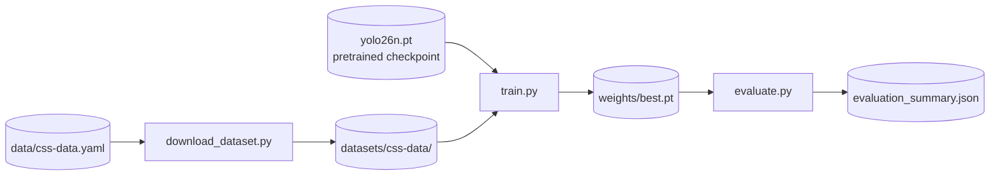

# Detector

!!! abstract "Orientation"
    The YOLO detector: given a frame, return boxes for persons and PPE items. This page tracks what is decided about the model.

## The Training Pipeline

Three scripts, run in order, each one handing its output to the next:



=== "Python"

    ```powershell
    python pipeline/download_dataset.py
    python pipeline/train.py --epochs 100 --batch 24 --workers 8 --name ppe_v2
    python pipeline/evaluate.py --weights runs/train/ppe_v2/weights/best.pt --split test --name ppe_v2
    ```

=== "Make"

    ```powershell
    make download
    make train NAME=ppe_v2 ARGS="--epochs 100 --batch 24 --workers 8"
    make evaluate NAME=ppe_v2 ARGS="--split test"
    ```

    `evaluate` defaults `WEIGHTS` to `runs/train/$(NAME)/weights/best.pt`, so it does not need to be passed explicitly when `NAME` already points at the run.

### What `train.py` Actually Runs

Every flag above resolves into one call:

```python
YOLO(model).train(
    data=str(data),
    epochs=epochs,
    imgsz=imgsz,
    batch=batch,
    cos_lr=True,
    save_period=10,
    plots=True,
    **{**AUGMENTATION, **overrides},
)
```

`model` starts from a pretrained checkpoint (`yolo26n.pt`), not random weights, so this is finetuning, not training from scratch. `AUGMENTATION` fixes the HSV jitter, flip, and mosaic settings ([Ultralytics](../knowledge/ultralytics.md#augmentation)); `**overrides` forwards any other Ultralytics `train()` argument straight from the CLI, so this script does not need to know every possible argument in advance. `cos_lr=True` decays the learning rate on a cosine schedule; `save_period=10` checkpoints every 10 epochs in addition to `best.pt` and `last.pt`.

### What `evaluate.py` Actually Runs

```python
model = YOLO(weights)
results = model.val(data=str(data), split=split, imgsz=imgsz, batch=batch, plots=True)

box = results.box
precision, recall = float(box.mp), float(box.mr)
summary = {
    "overall": {
        "map50_95": round(float(box.map), 4),
        "map50": round(float(box.map50), 4),
        "precision": round(precision, 4),
        "recall": round(recall, 4),
    },
    "per_class": per_class_metrics(box, names),
}
```

Every number in the results below comes straight out of this call: `box.map` / `box.map50` are mAP50-95 and mAP50 as defined on [object detection](../knowledge/object-detection.md#average-precision), `box.mp` / `box.mr` the mean precision and recall, and `per_class_metrics` walks the same underlying arrays (`box.ap_class_index`, `box.p`, `box.r`, `box.ap50`, `box.ap`) one class at a time to build the per-class table further down.

!!! tip "Verify Weights Before Wiring Them In"
    ```bash
    yolo predict model=<weights>.pt source=sample.jpg
    ```
    Look at the annotated output before trusting the model in the pipeline. `pipeline/detect.py` does the same thing with vocabulary-aware colouring.

## Related

- [YOLO](../knowledge/yolo.md) - how the architecture works
- [Object detection](../knowledge/object-detection.md) - what mAP, precision, and recall mean
- [Ultralytics](../knowledge/ultralytics.md) - AutoBatch, AMP, and resume behaviour
- [Tracking & association](tracking.md)
- [ADR 0001](../decisions/0001-positive-only-detection.md)
