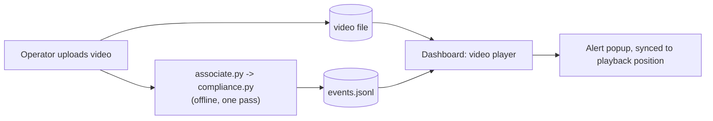

# Event Schema

!!! abstract "Orientation"
    The data contract between this pipeline and whatever consumes its violation events. A stable schema lets the two systems evolve independently.

!!! success "Live Schema Sample"
    `pipeline/compliance.py` writes one JSON object per line to `events.jsonl`, file-drop transport, each with an evidence JPEG saved alongside it. ==This is not the full external-system contract envisioned below (no HTTP/queue transport, privacy unaddressed)==, but it is real, working, and the right thing to build a first dashboard integration against.

## Current Shape

One line per event, written incrementally as `pipeline/compliance.py` processes a session:

```json
{
"event_id": 1, 
"track_id": 6, 
"violation": "no_vest", 
"start": 0.0, 
"end": 9.776, 
"status": "closed_track_lost", 
"reopens": 0,
"snapshot": "runs/compliance/ppe/snapshots/event_1.jpg"
}
```

| Field       | Type            | Meaning                                                                                                                                                                                                                                                                            |
| ----------- | --------------- | ---------------------------------------------------------------------------------------------------------------------------------------------------------------------------------------------------------------------------------------------------------------------------------- |
| `event_id`  | int             | Unique within one run of `compliance.py`. **Not globally unique across sessions**, don't use as a durable key without namespacing by run.                                                                                                                                          |
| `track_id`  | int             | The worker, from `pipeline/track.py`. See the track-id warning below before treating this as a person identifier.                                                                                                                                                                  |
| `violation` | string          | A closed enum, currently `no_hardhat` \| `no_vest`, sourced from `data/vocabulary.yaml`'s `violation` field on each `ppe` entry. Add a PPE type there, this enum grows automatically.                                                                                              |
| `start`     | float, seconds  | When the violation was confirmed (after the on-delay), not first suspected. See [compliance](compliance.md) for the hysteresis design.                                                                                                                                             |
| `end`       | float or `null` | `null` while the event is still open. A finished session should have no open events, see `status`.                                                                                                                                                                                 |
| `status`    | string          | `closed_normal` (PPE returned and stayed present through the off-delay) \| `closed_track_lost` (worker's track disappeared past the grace period) \| `closed_end_of_video` (session ended with the violation still active) \| `open` (should not appear in a completed run's file) |
| `reopens`   | int             | How many times this same `(track_id, violation)` recurred within the cooldown window and got merged into this event rather than creating a new one.                                                                                                                                |
| `snapshot`  | string or `null`| Local path to a JPEG grabbed from the source video at `start`, one per event. `null` if the source video wasn't available when `compliance.py` ran, or `--no-snapshots` was passed.                                                                                                |

Where it lives: `runs/compliance/<name>/events.jsonl`, alongside `compliance_summary.json` (counts by violation type, average duration, the thresholds used) and `snapshots/` (one JPEG per event with a non-null `snapshot`).

!!! info "Snapshot Accuracy"
    The snapshot is grabbed by seeking the source video to `start` and reading the nearest frame. On a compressed video that can land on the nearest keyframe rather than the exact frame, close enough for a dashboard thumbnail, not frame-perfect evidence.

## Offline Upload Workflow

The scenario this schema is validated for today: an operator uploads a finished video, the pipeline runs on it once, then the dashboard plays that same video back with violations overlaid at the right moment.



This works cleanly because `start`/`end` are already **seconds from the start of that video file**, not wall-clock time (`frame_idx / fps` in `pipeline/track.py`/`associate.py`). That is exactly the unit a browser video element's `currentTime` uses, so no conversion, no timezone handling, no clock sync between the pipeline and the dashboard, needed for this mode specifically.

!!! danger "Video and Events Parity"
    `start`/`end` only mean anything relative to the *exact* video file that produced them. If the uploaded video gets re-encoded, trimmed, or re-uploaded as a new file after the pipeline ran, the timestamps go stale. Key `events.jsonl` to the same identifier as the stored video (a run name, a content hash, whatever the dashboard already uses), don't just drop both files in a folder and assume they'll stay matched.

### What the Dashboard Needs to Do

1. **Run the pipeline on the uploaded video** (or start from the real example below), store it alongside the video
2. **Jump to a violation** when the operator clicks it in a list
3. **Show a popup while scrubbing/playing**, by checking whether `currentTime` falls inside any event's window as playback advances (e.g. on the video's `timeupdate` event)
4. **Draw a timeline strip** (a common "chapter markers" UI) using `event.start / videoDuration` and `event.end / videoDuration` as left/width fractions of a bar under the scrubber, one colored segment per `violation` type.
5. **Group by `track_id`** if you want a per-worker view, but keep in mind, a fragmented track means one real worker can appear as two rows.
6. **Show `snapshot` as a thumbnail** in the violation list or popup when it isn't `null`, evidence without needing to scrub the video first.

This offline mode is what exists and is tested today. **Live/real-time is a different, not-yet-built mode**: it needs wall-clock timestamps instead of video-relative ones, and `compliance.py` restructured to emit events incrementally rather than after a full pass, don't build the dashboard's live-alert path against this schema assuming it already supports that, it doesn't yet.

## Reproducing Event Emission

A real, already-generated example, one video in, one `events.jsonl` out, lives in `examples/offline-dashboard-demo/`. Its own `README.md` documents exactly how it was produced (detector, tracker, and compliance settings used), what each file in the folder is, and known rough edges worth reading before assuming a dashboard bug, tracking fragmentation on that clip in particular. Start there before building against a freshly generated run.

!!! warning "The Example Is Not Correct, the Shape Is the Point"
    This example's actual event values, how many events, their timing, which worker they're attached to, are ==not correct==: the detector is not yet retrained on the team's dataset, and every compliance threshold is a reasoned starting guess, not one tuned against labelled ground truth (see the rough edges in that README). What is stable, and worth building a dashboard integration against now, is the ==wire format==, the field names, types, and status enum documented above. That is the contract. Once the detector and thresholds are finalised, the same shape ships with correct values; nothing about the schema itself is expected to change on the way there.

To reproduce against a video of your own:

```powershell
python pipeline/associate.py --weights <best.pt> --source <video> --output runs/associate/<name>
python pipeline/compliance.py --associations runs/associate/<name>/associations.jsonl --output runs/compliance/<name>
```

## Related

- [Compliance state](compliance.md) - the smoothing/hysteresis/dedup logic that produces these events
- [PPE vocabulary](vocabulary.md) - the source of the violation enum
- [Tracking & association](tracking.md) - where `track_id` comes from, and its current known limits
