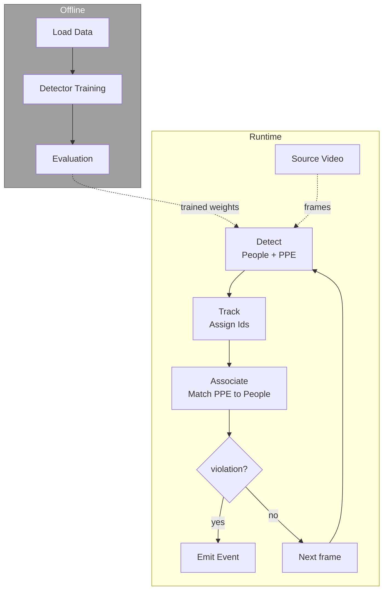

# Stages

!!! abstract "Orientation"
    The system as two halves: an offline half that produces a trained detector, and a runtime half that watches a camera feed frame by frame. Detail on each runtime stage lives on its own page.

## Offline and Runtime

**Offline (grey box).** Before any camera ever runs, the detector has to exist. Download the labelled dataset, train the detector on it, then evaluate it on images it has not seen to find out how good it actually is. This happens once, or whenever the model is retrained, never for a live frame, and it produces the one thing the runtime half needs: a trained set of weights. See [Detector](detector.md).

**Runtime (repeats every frame).** Once a trained detector exists, every frame from the camera goes through the same four steps:

- **Detect** finds every person and PPE item in the frame.
- **Track** keeps each person's identity stable from one frame to the next, so "this person" means the same worker throughout a clip, not a new stranger every frame.
- **Associate** works out which PPE box belongs to which tracked person.
- **Decide** looks at a person's PPE history over time, not just this one frame, and asks whether this is a real, sustained violation or just a flicker. If yes, **Emit** sends one event. If no, nothing happens, and the loop moves to the next frame.

!!! tip "Frames vs. Seconds"
    Every threshold Decide uses, how long a violation must persist, how long to wait before clearing it, is a duration. The runtime loop only ever sees frames, so those durations are converted using the camera's frame rate rather than counted in raw frames; a threshold left in bare frame count would silently change meaning the moment the frame rate changed.

## Related

- [Detector](detector.md) - the offline half, in full
- [Tracking & association](tracking.md) - Track and Associate
- [Compliance state](compliance.md) - Decide
- [Event schema](schemas.md) - Emit
