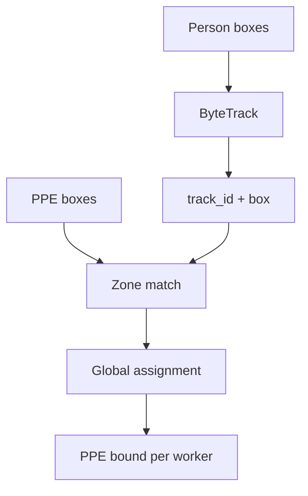
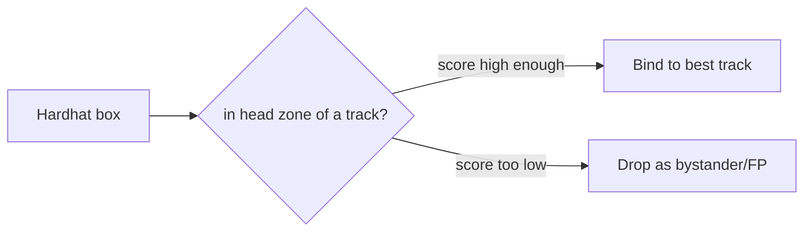
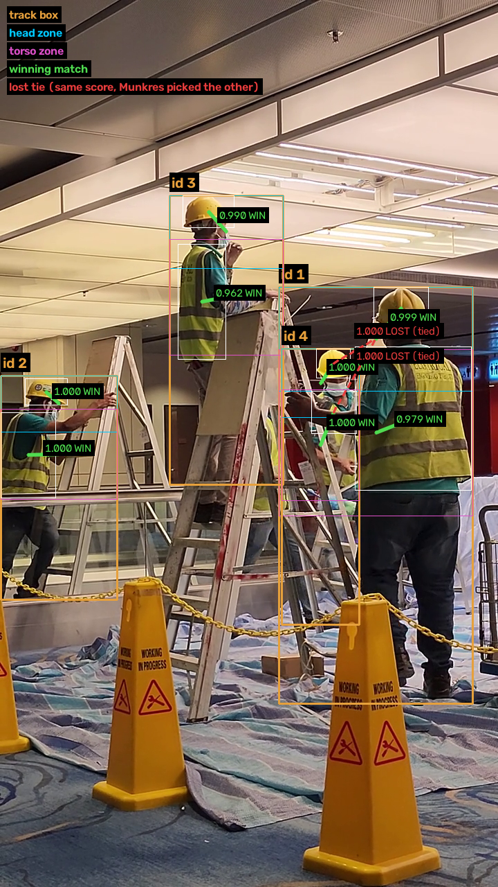

# Tracking & association

!!! abstract "Orientation"
    ByteTrack person tracking (`pipeline/track.py`) and PPE-to-worker association (`pipeline/associate.py`). Give every worker a ==stable identity== across frames, then bind each PPE box to ==exactly one worker==. This is the core of the project's own work.

!!! info "Tracker Tuned; Association Still Placeholder"
    ByteTrack's config has been tuned against a real clip, with measured evidence below. Association's zone geometry and minimum containment score are still starting values, not yet measured against footage.

## Flow



## ByteTrack

`pipeline/track.py` calls `model.track(...)` with a project-specific config, `pipeline/trackers/bytetrack_ppe.yaml`:

- ==Persons only== go to the tracker; mixing classes causes id switches
- The tracker config is tuned away from the Ultralytics default, not left as-is

| Parameter | Ultralytics default | This project | Why |
|---|---|---|---|
| `track_buffer` | 30 | 60 (2s at 30fps) | A briefly occluded worker keeps their id |
| `fuse_score` | `True` | `False` | `fuse_score` multiplies IoU by detection confidence in the match cost, so a low-confidence box needs a proportionally *higher* IoU to match, exactly backwards for a small, distant worker |
| `match_thresh` | 0.8 | 0.9 | Looser matching, combined with `fuse_score=False` |

Measured on one clip (`videos/15100674_1080_1920_30fps.mp4`), weights and `imgsz` held constant: `fuse_score=False` alone cut spurious track count from 100 to 74 and turned 3 previously fragmented workers into single continuous tracks; adding `match_thresh=0.9` dropped it further to 67, with no loss in long-track coverage (55-99%, still 9 long-lived tracks), no sign of the opposite failure, two different people merging into one track.

!!! warning "Track Count and Coverage Are a Proxy"
    This was verified by track count and long-track coverage on one clip, not by eye against actual id switches. Watch the annotated output (tip below) before trusting it further.

!!! info "Upgrade Path If Needed"
    ByteTrack has no appearance model, so heavy crossing/occlusion causes id switches. `pipeline/trackers/botsort_ppe.yaml` already exists for this: BoT-SORT adds a ReID embedding, matching on visual similarity as well as motion. Start with ByteTrack, upgrade on measured evidence.

## Association

Two rules make binding robust, both implemented in `pipeline/associate.py`:

1. **Match against a body zone, not the whole person box.** A hardhat is expected in the top region of the person box, a vest in the torso band. The zone comes from the PPE type. See [the vocabulary](vocabulary.md).
2. **Score by containment, then assign globally.** Containment (PPE area inside the zone / PPE area) beats IoU for a small item inside a large box. A global (Hungarian) assignment then gives each PPE box, within one region, to its single best worker, so two nearby workers cannot both claim one hardhat.

| Region | Fraction of person-box height | Rationale |
|---|---|---|
| `head` | 0.00 - 0.25 | Generous enough for a hardhat brim above the box edge; tight enough to fail a hardhat held at waist height, the classic carried-not-worn false pass |
| `torso` | 0.15 - 0.55 | Shoulders to hips |

A PPE box counts as associated only above `min_containment = 0.5`, CLI-overridable via `--min-containment`. Both the zone fractions and this threshold are starting placeholders, not measured values.



### Worked Example



!!! tip 
    Generated straight from the pipeline's own functions on one real frame, not illustrative, every score shown is a real output and every line is a real result.

Here `id 1` and `id 4`'s boxes are almost entirely stacked on top of each other, this causes track-fragmentation issue: either two ids for one real worker, or two workers standing close enough that their boxes overlap heavily. That overlap is exactly what produces the two dashed red **LOST (tied)** lines: a hardhat box scores a perfect `1.000` containment against *both* `id 1`'s and `id 4`'s head zones simultaneously because its entirely contained in both, making them geometrically indistinguishable.

Munkres assigns it to `id 4` (green `1.000 WIN`), not because that zone deserved it more, but because `id 1` has a *second* valid hardhat available (`0.999`) with no other claimant, while this box is `id 4`'s only candidate. Giving it to `id 4` fills both zones instead of leaving one empty, that is the global nearest neighbor in action: it maximizes total score across *all* pairs at once, not the highest score per pair is taken. The same pattern repeats on the vest just below it.

`id 2` and `id 3` are the uncontested, ordinary case for comparison, one clean candidate each, nothing lost.


!!! tip "Verify Identities Before Tuning Association"
    === "Python"

        ```powershell
        python pipeline/track.py --weights runs/train/ppe_v2/weights/best.pt --source clip.mp4 --show
        ```

    === "Make"

        ```powershell
        make track NAME=ppe_v2 SOURCE=clip.mp4 ARGS="--show"
        ```

    Watch ids stay put through a crossing. Fix id switches first, they corrupt every downstream number.

## Related

- [Compliance state](compliance.md)
- [PPE vocabulary](vocabulary.md)
