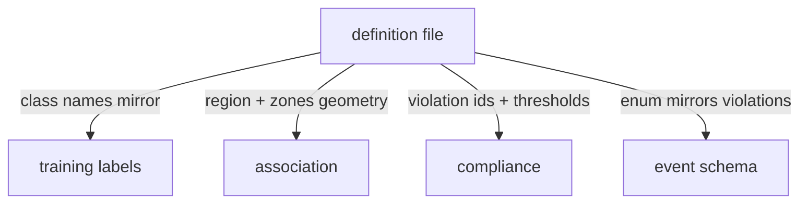

# PPE vocabulary

!!! abstract "Orientation"
    The ==one definition== of what PPE exists, where on the body it belongs, and what its absence means, in a single file that everything else conforms to.


## The Principle

A PPE type touches four places: the training class list, the association body-zones, the compliance state keys, and the event enum. If each keeps its own copy, they drift, and drift here is silent: a hardhat matched against the wrong zone, or an event the external system rejects.

==One authoritative file== defines the vocabulary; everything else mirrors it and none may extend it.



!!! warning "Conformers Do Not Define"
    Adding a PPE type means editing the definition file first, then letting the others follow. Editing a conformer first is how the copies diverge.

## Schema

The shape any vocabulary file must follow, independent of the current values:

```yaml
subject: <string>                  # exactly one; must be a class name the trained model knows

ppe:                               # positive PPE classes
  <class name>:
    region: <string>               # must be a key defined under `zones` below
    violation: <string>            # arbitrary id; `negative` entries key off this to share a zone

negative:                          # the dataset's NO-* classes
  <class name>: <violation id>     # must match a `violation` value under `ppe`, or associate.py skips it with a warning

ignore:                            # detected but never raise an event
  - <class name>

zones:                             # body-zone geometry
  <region name>: [<top fraction>, <bottom fraction>]   # 0.0-1.0, fraction of a person box's height

min_containment: <float>           # 0.0-1.0, minimum score for a PPE box to count as associated

compliance:                        # every value a duration in seconds, except present_ratio
  window_seconds: <float>
  present_ratio: <float>           # 0.0-1.0
  on_delay_seconds: <float>
  off_delay_seconds: <float>
  cooldown_seconds: <float>
  track_loss_close_seconds: <float>
```

Two constraints only enforced at read time, not by the file format itself: a `negative` entry's violation id with no matching `ppe` entry is silently dropped (a warning prints, association just does not consider it), and a `ppe` region with no matching key under `zones` raises immediately, `associate.py` cannot invent a zone it was not told the geometry of.

## What It Currently Defines

Seven top-level keys, each read by exactly one layer:

| Key | Value | Read by, and for what |
|---|---|---|
| `subject` | `Person` | The one tracked entity. `pipeline/track.py` resolves this name to a class id on the trained model, never hardcoded |
| `ppe` | `Hardhat` (`region: head`, `violation: no_hardhat`), `Safety Vest` (`region: torso`, `violation: no_vest`) | The positive PPE classes. `region` tells association which entry in `zones` to match a box against; `violation` is the key compliance state is stored under |
| `negative` | `NO-Hardhat` → `no_hardhat`, `NO-Safety Vest` → `no_vest` | The dataset's negative classes, mapped to the same violation id as their positive counterpart. Recorded by `pipeline/associate.py` but not currently wired into the compliance decision either way; see [ADR 0001](../decisions/0001-positive-only-detection.md) |
| `ignore` | `Safety Cone`, `machinery`, `vehicle` | Detected but never raise an event |
| `zones` | `head: [0.00, 0.25]`, `torso: [0.15, 0.55]` | Fraction of a tracked person's box height each region covers. `pipeline/associate.py` reads this directly; see [tracking](tracking.md) for the reasoning behind each range |
| `min_containment` | `0.5` | Minimum containment score for a PPE box to count as associated to a worker. `--min-containment` overrides it per run |
| `compliance` | `window_seconds: 0.5`, `present_ratio: 0.5`, `on_delay_seconds: 3.0`, `off_delay_seconds: 2.0`, `cooldown_seconds: 5.0`, `track_loss_close_seconds: 3.0` | The smoothing, hysteresis, and deduplication thresholds `pipeline/compliance.py` runs on, each overridable per run by its own CLI flag; see [compliance](compliance.md) |

Each `ppe` entry carries the two fields association and compliance need:

```yaml
Hardhat:
    region: head          # which body zone association matches in
    violation: no_hardhat # the key compliance state is stored under
```

## Related

- [Detector](detector.md)
- [Tracking & association](tracking.md)
- [Event schema](schemas.md)
- [ADR 0001](../decisions/0001-positive-only-detection.md)
